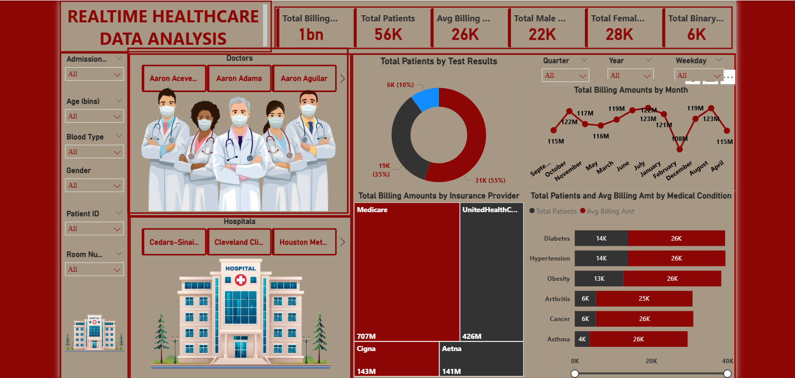

# 🏥 Real-Time Healthcare BI Dashboard

## 📌 Project Overview

This project presents an end-to-end **Business Intelligence solution** in the healthcare domain using **Power BI**.  
It analyzes patient records, billing trends, insurance data, and medical conditions to generate actionable insights for decision-making.

---

## 🎯 Objectives

- Analyze patient demographics and healthcare trends  
- Track billing performance over time  
- Evaluate insurance provider contributions  
- Identify high-cost medical conditions  
- Build an interactive dashboard for stakeholders  

---

## 🛠️ Tools & Technologies

- Power BI Desktop  
- Power Query (ETL Process)  
- DAX (Data Analysis Expressions)  
- Microsoft Excel (.xlsx) as data source  

---

## 🔄 ETL Process

### 🔹 Extract
- Imported healthcare dataset from Excel file (.xlsx) into Power BI  

### 🔹 Transform
- Cleaned missing and inconsistent values  
- Standardized data types (Date, Number, Text)  
- Created calculated columns (Age groups, Categories)  
- Applied data transformations using Power Query  

### 🔹 Load
- Loaded cleaned data into Power BI model  
- Built relationships between tables  
- Designed star schema for reporting  

---

## 📊 Dashboard Features

- 💰 Total Billing Amount: **9M**  
- 👥 Total Patients: **324**  
- 📈 Average Billing Amount: **27K**  
- 📅 Monthly Billing Trends  
- 🏥 Insurance Provider Analysis  
- 🧪 Test Result Distribution  
- 🩺 Disease-wise Analysis (Diabetes, Hypertension)  

---

## 🧠 Data Model

- **Fact Table**
  - Patient Billing Transactions  

- **Dimension Tables**
  - Patients  
  - Doctors  
  - Hospitals  
  - Insurance Providers  

---

## 📁 Project Structure

healthcare-bi-dashboard/
│
├── README.md
├── dashboards/
│   └── healthcare_dashboard.pbix
├── data/
│   └── Healthcare Analysis Dataset.xlsx
├── images/
│   └── healthcare_dashboard.png

## 📷 Dashboard Preview

